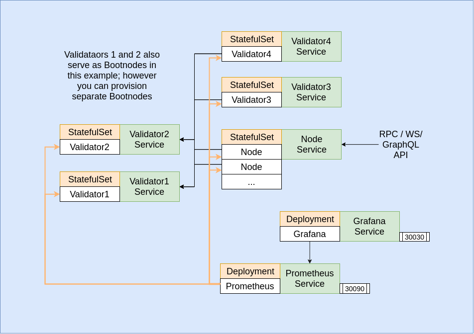
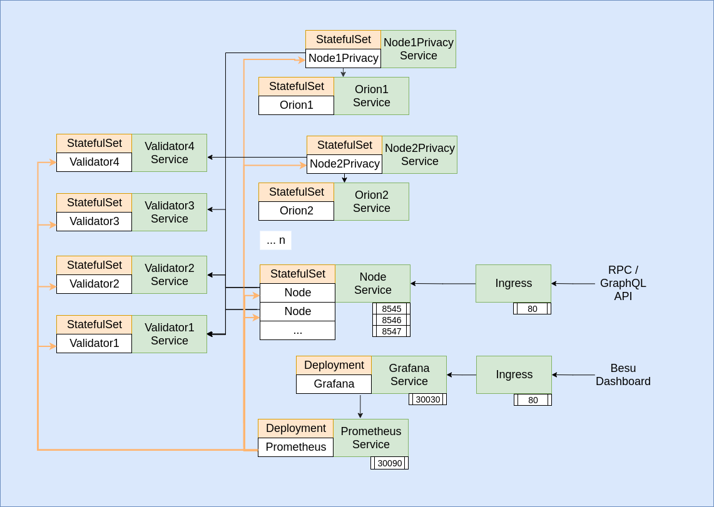

## Overview of Setup


## Overview of Setup (with orion)


#### 1. Deploy:
```bash
./deploy.sh
```

#### 2. Delete
```
./remove.sh
```

## Monitoring:
- Monitoring via prometheus & grafana is also setup up in a separate *monitoring* namespace and exposed via NodePort services (ports 30090, 30030 respectively)
- Credentials for grafana are admin:password. When grafana loads up select the "besu Dashboard"
